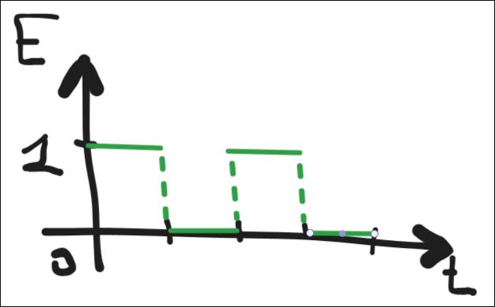
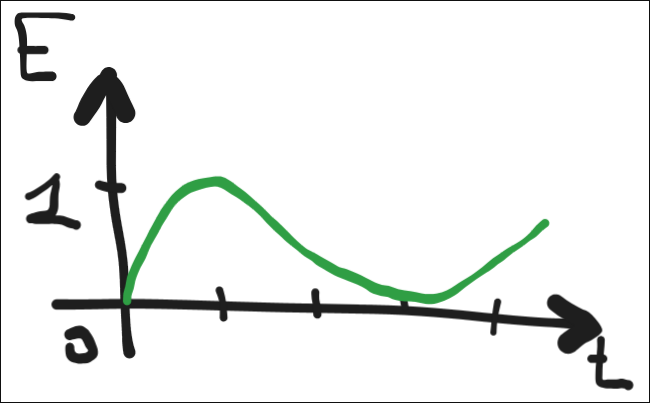
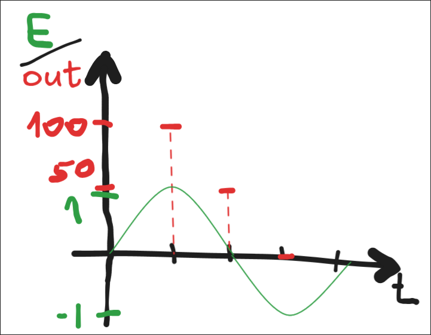

## Аналоговий Ввід/Вивід: Теоретична Частина

### Цифровий та Аналоговий Сигнали: Ключова Різниця

Вся електроніка працює з електричними сигналами. Їх поділяють на два основні типи, які визначають, як ми підключаємо сенсори та актуатори.

#### 1. Цифровий Сигнал (Digital)

| Характеристика | Опис |
| :--- | :--- |
| **Суть** | Сигнал, який має лише **два стани**: **ВВІМКНЕНО** (логічна "1" або висока напруга, наприклад, 3.3 В) або **ВИМКНЕНО** (логічний "0" або низька напруга, наприклад, 0 В). |
| **Приклади** | Кнопка (натиснута/не натиснута), світлодіод (світить/не світить), цифровий сенсор руху (є рух/немає руху). |
| **Ввід/Вивід** | **Цифровий ввід (Input):** Зчитує 0 або 1. **Цифровий вивід (Output):** Надсилає 0 або 1. |

#### 2. Аналоговий Сигнал (Analog)

| Характеристика | Опис |
| :--- | :--- |
| **Суть** | Сигнал, який може приймати **нескінченну кількість значень** у певному діапазоні (наприклад, від 0 В до 3.3 В). Він є безперервним. |
| **Приклади** | Датчик температури (температура може бути 20.1°C, 20.15°C і т.д.), регулятор гучності, плавне світіння світлодіода. |
| **Ввід/Вивід** | **Аналоговий ввід (Input):** Вимірює фактичну напругу. **Аналоговий вивід (Output):** Імітує зміну напруги (за допомогою ШІМ). |

---

### Аналоговий Ввід (Analog Input) на Micro:bit

Аналоговий ввід дозволяє micro:bit "бачити" градації, а не лише "Так" або "Ні".

#### 1. Як це працює? (АЦП)

* **АЦП (Аналогово-Цифровий Перетворювач):** Це спеціальний блок у мікроконтролері. Оскільки контролер розуміє лише цифрові дані (0 і 1), АЦП перетворює змінну напругу, що надходить із сенсора (аналоговий сигнал), на числовий діапазон.

* **Діапазон micro:bit:** Micro:bit зчитує аналоговий ввід як число від **0** (0 В) до **1023** (3.3 В). Це число відображає рівень напруги.

#### 2. Приклади аналогових сенсорів:

* **Датчик освітленості:** Чим більше світла, тим вище значення (ближче до 1023).
* **Потенціометр (змінний резистор):** Зміна положення ручки дає значення від 0 до 1023.
* **Аналоговий датчик температури/вологості.**

---

### Аналоговий Вивід (Analog Output) на Micro:bit

На micro:bit немає справжнього аналогового виводу. Замість цього використовується метод імітації, який називається **Широтно-Імпульсна Модуляція (ШІМ)**.

#### 1. Як працює ШІМ (PWM - Pulse-Width Modulation)

* **Суть:** Замість того, щоб подавати постійну низьку напругу, micro:bit швидко вмикає і вимикає цифровий сигнал (постійні імпульси).
* **Duty Cycle:** Це відношення часу, коли сигнал **УВІМКНЕНО** (логічна 1), до загального часу імпульсу.
    * **Duty Cycle 100%:** Сигнал завжди УВІМКНЕНО (повна яскравість світлодіода).
    * **Duty Cycle 50%:** Сигнал УВІМКНЕНО половину часу (світлодіод світить впівока).
    * **Duty Cycle 0%:** Сигнал завжди ВИМКНЕНО.
* **Результат:** Людське око або мотор через інерцію не встигають помітити швидке вмикання/вимикання. Вони реагують на **середнє значення** напруги, що сприймається як плавна зміна (аналоговий ефект).
* **Діапазон micro:bit:** Для аналогового виводу ШІМ-значення зазвичай встановлюються в діапазоні від **0** (повністю ВИМКНЕНО) до **1023** (повністю УВІМКНЕНО).

#### 2. Приклади аналогового виводу:

* **Керування яскравістю світлодіода.**
* **Керування швидкістю DC-двигуна.**
* **Генерування мелодій на динаміку** (зміна частоти та скважності імпульсів).

---

### Підключення на Micro:bit

Для роботи з аналоговими сигналами найчастіше використовуються великі золотисті контакти на нижньому краю плати micro:bit, позначені як **P0, P1, P2**.

* **P0, P1, P2:** Ці піни підтримують як цифровий, так і аналоговий ввід/вивід (за допомогою ШІМ). P0 зазвичай використовується для аналогових операцій за замовчуванням.
* **3V & GND:** Пін **3V** забезпечує живлення (3.3 В) для зовнішніх компонентів, а **GND** (Ground) — це спільний "нульовий" провід.

---
