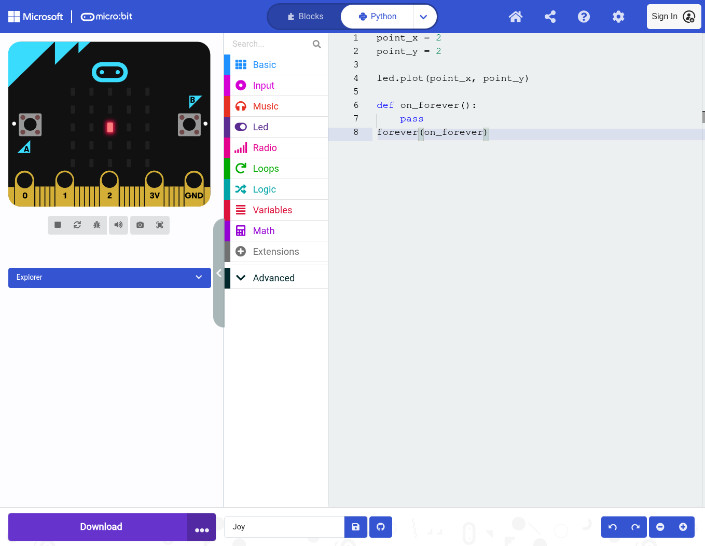
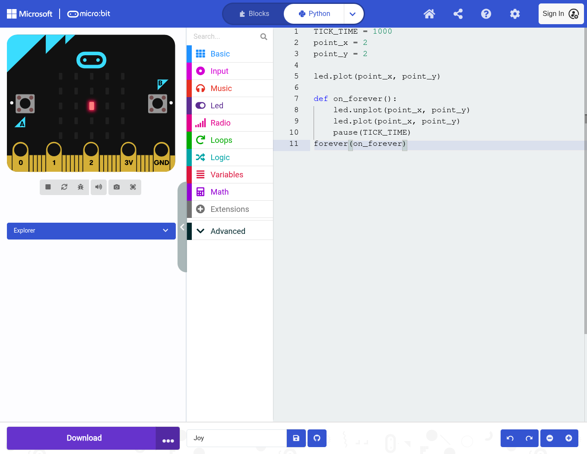
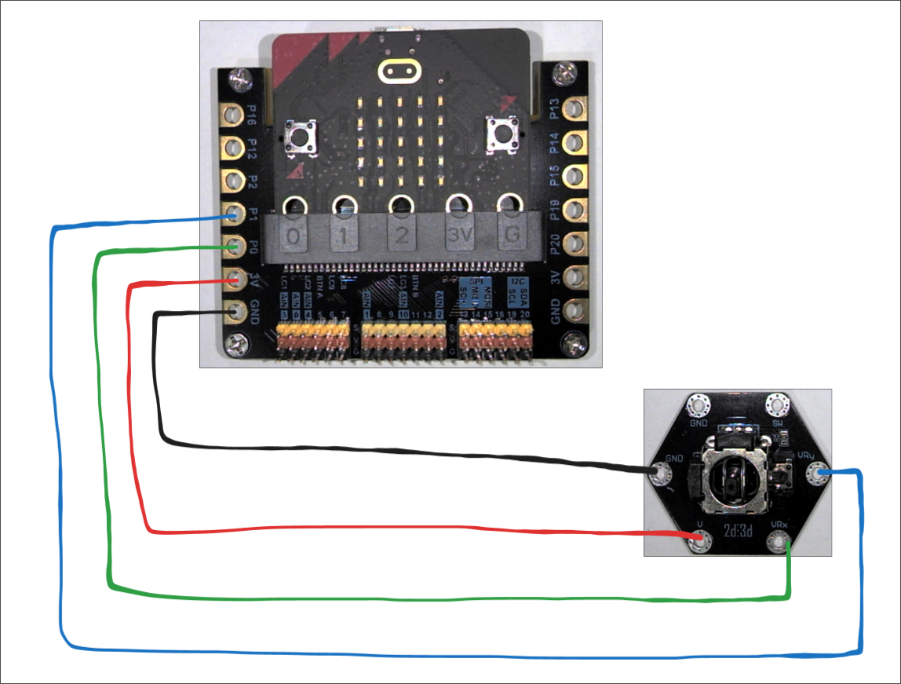

### Управління джойстиком

Задача викорисати джойстик підключивши його до двох аналогових входів на контролері та поєднати ввід з управлінням діоду


1. Почнемо з простого коду, заставимо один діод горіти по центру

    ```python
    ~ point_x = 2                         # Змінна - X координата
    ~ point_y = 2                         # Змінна - Y координата

    ~ led.plot(point_x, point_y)          # Засвітити діод на позиції

    ~ def on_forever():                   # Оголошуємо функцію яка міститиме наш головний код
    ~     pass                            # pass - нічого не робимо
    ~ forever(on_forever)                 # Говоримо комп'ютеру щоб він постійно викликав функцію
    ```
    

1. Додамо код для зміни нашого діоду(код не буде змінювати позицію). 
    ```python
    ~ TICK_TIME = 1000                    # Змінна - час очікування
      point_x = 2                         # Змінна - X координата
      point_y = 2                         # Змінна - Y координата

      led.plot(point_x, point_y)          # Засвітити діод на позиції

      def on_forever():                   # Оголошуємо функцію яка міститиме наш головний код
    ~     led.unplot(point_x, point_y)    # Виключити діод
    ~     led.plot(point_x, point_y)      # Ввімкнути діод
    ~     pause(TICK_TIME)                # Очікуємо 1000 мілісекунд
      forever(on_forever)                 # Говоримо комп'ютеру щоб він постійно викликав функцію
    ```
    

1. Зчитаємо наші дані з пінів за допомогою pins.analog_read_pin() і спробуємо змістити точку просто додавши значення до координат

    ```python
      TICK_TIME = 1000                    # Змінна - час очікування
      point_x = 2                         # Змінна - X координата
      point_y = 2                         # Змінна - Y координата
      calibrated_v_x = infinity           # Змінна - X який буде 0
      calibrated_v_y = infinity           # Змінна - Y який буде 0
  
      def on_button_pressed_a():                              # Оголошуємо функцію яка буде опрацьовуватися при натисканні
          global calibrated_v_x, calibrated_v_y               # Використати глобальнні змінні
          calibrated_v_x = pins.analog_read_pin(AnalogPin.P0) # Зчитати пін 0 і записати його для подальшої роботи
          calibrated_v_y = pins.analog_read_pin(AnalogPin.P1) # Зчитати пін 1 і записати його для подальшої роботи
      input.on_button_pressed(Button.A, on_button_pressed_a)  # Говоримо комп'ютеру яку функцію викликати при натисканні кнопки
  
      led.plot(point_x, point_y)          # Засвітити діод на позиції
  
    ~ def sign(n:number) -> number:       # Функція визначення знаку
    ~     if n == 0.0:                    # Перевірити чи n є 0
    ~         return 0                    # Якщо так то повернути 0
    ~     elif n < 0.0:                   # Якщо ні то перевірити чи n менше 0 
    ~         return -1.0                 # Якшо так то повернути -1
    ~     else:                           # Якшо ні то
    ~         return 1.0                  # Повернути 1
  
      def on_forever():                   # Оголошуємо функцію яка міститиме наш головний код
          global point_x, point_y         # Використати глобальнні змінні
          global calibrated_v_y           # ↑↑
          global calibrated_v_x           # ↑
  
          if calibrated_v_y == infinity or calibrated_v_x == infinity: # Перевірити чи ми зробили калібрацію нуля
              return                                                   # Вийти з функції
  
          v_x = pins.analog_read_pin(AnalogPin.P0) # Зчитати пін 0
          v_y = pins.analog_read_pin(AnalogPin.P1) # Зчитати пін 1
          led.unplot(point_x, point_y)    # Виключити діод
    ~     d_x = v_x - calibrated_v_x      # Знайти зміщення по x
    ~     d_y = v_y - calibrated_v_y      # Знайти зміщення по y
    ~     point_x = point_x + sign(d_x)   # Змістити координату X
    ~     point_y = point_y + sign(d_y)   # Змістити координату Y
          led.plot(point_x, point_y)      # Ввімкнути діод
          pause(TICK_TIME)                # Очікуємо 1000 мілісекунд
      forever(on_forever)                 # Говоримо комп'ютеру щоб він постійно викликав функцію
    ```

1. У нашого симулятора є проблема ми не можемо виставити значення 0 на пінах аж поки ми не натиснемо кнопку А. Виправимо це просто додавши зчитування з пінів на початку роботи

    ```python
      TICK_TIME = 1000                    # Змінна - час очікування
      point_x = 2                         # Змінна - X координата
      point_y = 2                         # Змінна - Y координата
      calibrated_v_x = infinity           # Змінна - X який буде 0
      calibrated_v_y = infinity           # Змінна - Y який буде 0
  
    ~ _ = pins.analog_read_pin(AnalogPin.P0)  # Нам потрібно зчитати пін щоб ініціалізувати симулятор
    ~ _ = pins.analog_read_pin(AnalogPin.P1)  # ↑
  
      def on_button_pressed_a():                              # Оголошуємо функцію яка буде опрацьовуватися при натисканні
          global calibrated_v_x, calibrated_v_y               # Використати глобальнні змінні
          calibrated_v_x = pins.analog_read_pin(AnalogPin.P0) # Зчитати пін 0 і записати його для подальшої роботи
          calibrated_v_y = pins.analog_read_pin(AnalogPin.P1) # Зчитати пін 1 і записати його для подальшої роботи
      input.on_button_pressed(Button.A, on_button_pressed_a)  # Говоримо комп'ютеру яку функцію викликати при натисканні кнопки
  
      led.plot(point_x, point_y)          # Засвітити діод на позиції
  
      def sign(n:number) -> number:       # Функція визначення знаку
          if n == 0.0:                    # Перевірити чи n є 0
              return 0                    # Якщо так то повернути 0
          elif n < 0.0:                   # Якщо ні то перевірити чи n менше 0 
              return -1.0                 # Якшо так то повернути -1
          else:                           # Якшо ні то
              return 1.0                  # Повернути 1
  
      def on_forever():                   # Оголошуємо функцію яка міститиме наш головний код
          global point_x, point_y         # Використати глобальнні змінні
          global calibrated_v_y           # ↑↑
          global calibrated_v_x           # ↑
  
          if calibrated_v_y == infinity or calibrated_v_x == infinity: # Перевірити чи ми зробили калібрацію нуля
              return                                                   # Вийти з функції
  
          v_x = pins.analog_read_pin(AnalogPin.P0) # Зчитати пін 0
          v_y = pins.analog_read_pin(AnalogPin.P1) # Зчитати пін 1
          led.unplot(point_x, point_y)    # Виключити діод
          d_x = v_x - calibrated_v_x      # Знайти зміщення по x
          d_y = v_y - calibrated_v_y      # Знайти зміщення по y
          point_x = point_x + sign(d_x)   # Змістити координату X
          point_y = point_y + sign(d_y)   # Змістити координату Y
          led.plot(point_x, point_y)      # Ввімкнути діод
          pause(TICK_TIME)                # Очікуємо 1000 мілісекунд
      forever(on_forever)                 # Говоримо комп'ютеру щоб він постійно викликав функцію
    ```

1. Наступна проблема полягає в тому що наша точка може зникнути з поля зору якщо тримати контролер напрямленим в одну сторону дуже дового. Виправимо це за допомогою нової функції - clamp яка буде обмежувати нас дозволяючи записувати в poing_{x,y} лише 0,1,2,3,4

    ```python
      TICK_TIME = 1000                    # Змінна - час очікування
    ~ MIN_LED = 0
    ~ MAX_LED = 4
      point_x = 2                         # Змінна - X координата
      point_y = 2                         # Змінна - Y координата
      calibrated_v_x = infinity           # Змінна - X який буде 0
      calibrated_v_y = infinity           # Змінна - Y який буде 0
  
      _ = pins.analog_read_pin(AnalogPin.P0)  # Нам потрібно зчитати пін щоб ініціалізувати симулятор
      _ = pins.analog_read_pin(AnalogPin.P1)  # ↑
  
      def on_button_pressed_a():                              # Оголошуємо функцію яка буде опрацьовуватися при натисканні
          global calibrated_v_x, calibrated_v_y               # Використати глобальнні змінні
          calibrated_v_x = pins.analog_read_pin(AnalogPin.P0) # Зчитати пін 0 і записати його для подальшої роботи
          calibrated_v_y = pins.analog_read_pin(AnalogPin.P1) # Зчитати пін 1 і записати його для подальшої роботи
      input.on_button_pressed(Button.A, on_button_pressed_a)  # Говоримо комп'ютеру яку функцію викликати при натисканні кнопки
  
      led.plot(point_x, point_y)          # Засвітити діод на позиції
  
    ~ def clamp(n:number, min:number, max:number) -> number:  # Функція яка обмежує значення
    ~     if n < min:                                         # Перевірити чи n менше min 
    ~         return min                                      # Якщо так повернути min
    ~     elif n > max:                                       # Якщо ні перевірити чи n більше max
    ~         return max                                      # Якщо так повернути max
    ~     else:                                               # Якщо ні
    ~         return n                                        # Повернути n
  
      def sign(n:number) -> number:       # Функція визначення знаку
          if n == 0.0:                    # Перевірити чи n є 0
              return 0                    # Якщо так то повернути 0
          elif n < 0.0:                   # Якщо ні то перевірити чи n менше 0 
              return -1.0                 # Якшо так то повернути -1
          else:                           # Якшо ні то
              return 1.0                  # Повернути 1
  
      def on_forever():                   # Оголошуємо функцію яка міститиме наш головний код
          global point_x, point_y         # Використати глобальнні змінні
          global calibrated_v_y           # ↑↑
          global calibrated_v_x           # ↑
  
          if calibrated_v_y == infinity or calibrated_v_x == infinity: # Перевірити чи ми зробили калібрацію нуля
              return                                                   # Вийти з функції
  
          v_x = pins.analog_read_pin(AnalogPin.P0) # Зчитати пін 0
          v_y = pins.analog_read_pin(AnalogPin.P1) # Зчитати пін 1
          led.unplot(point_x, point_y)    # Виключити діод
          d_x = v_x - calibrated_v_x      # Знайти зміщення по x
          d_y = v_y - calibrated_v_y      # Знайти зміщення по y
    ~     point_x = clamp(point_x + sign(d_x), MIN_LED, MAX_LED)   # Змістити координату X на -1 або +1 і обмежити лише до 0-4
    ~     point_y = clamp(point_y + sign(d_y), MIN_LED, MAX_LED)   # Змістити координату Y на -1 або +1 і обмежити лише до 0-4
          led.plot(point_x, point_y)      # Ввімкнути діод
          pause(TICK_TIME)                # Очікуємо 1000 мілісекунд
      forever(on_forever)                 # Говоримо комп'ютеру щоб він постійно викликав функцію
    ```

1. Тепер найважливіше - зібрати електричний ланцюг і прошити наш контролер

    

Результат: 
    <video controls src="https://github.com/user-attachments/assets/03a15ee4-bbbe-4056-8a64-a54dd6238f35">
    </video>

### Додаткове завдання

1. Змінити напрямок руху по осі Y(інвертувати напрямок)
1. Додати stealth на кнопку B, вимкнути світіння діод але зберегти рух його по масиву діодів, при повторному натисаннні ввімкунти світіння
1. При дотику до стінок програвати звук
